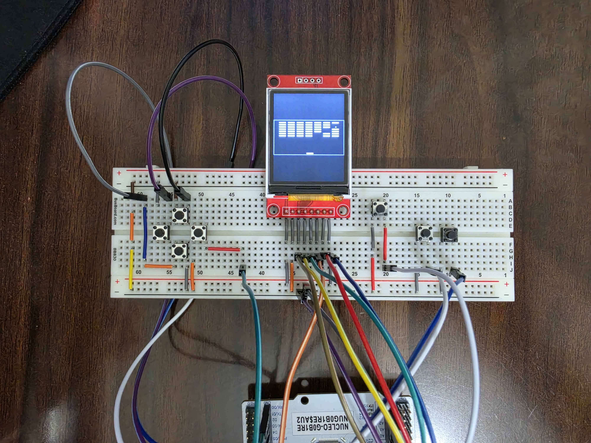

# chip8stm32
My first embedded project. 

After I had finished my Game Boy Color emulator, I was interested in porting it over to a microcontroller to make a pseudo-handheld. However, as this was my first embedded project *(and also because the screen size for the display I was using was not big enough to support the Game Boy's screen size)*, I decided to scale it back, and instead, port over my CHIP-8 emulator. 

As such, I chose to use a library to handle the display as I was more interested/keen on a having a prototype that was functional. Though in the future, I do want to write my own drivers for the display. Moreover, due to practical reasons, the input controls are limited to the WASD keys, so games that require keys other than WASD will be unplayable.

## Hardware Used
- STM32-G0B1RE
- ST7735S SPI TFT LCD Display

##  Libraries
[ST7735S-STM32 by maudeve-it](https://github.com/maudeve-it/ST7735S-STM32)